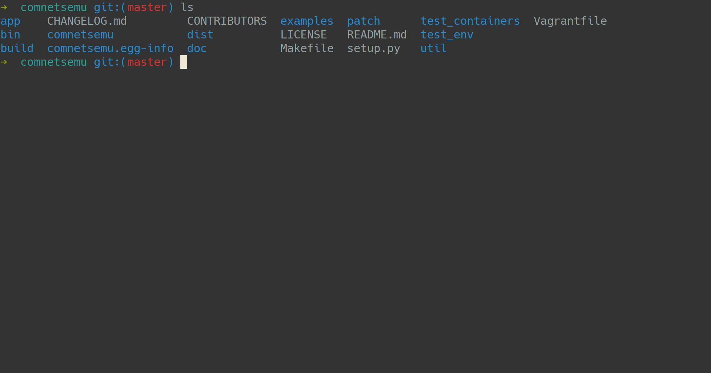

[](https://travis-ci.com/stevelorenz/comnetsemu)
[](https://github.com/stevelorenz/comnetsemu/blob/master/LICENSE)

ComNetsEmu
==========
*A holistic testbed/emulator for the book: Computing in Communication Networks: From Theory to Practice*

**This project is currently under heavy development [beta]**.

The repository is hosted both on the internal [Gitlab server of ComNets TUD](https://git.comnets.net/public-repo/comnetsemu) and
[Github](https://github.com/stevelorenz/comnetsemu).
The GitLab ComNets TUD is read-only for public users (only for internal usage).
For all public users, please create issues and send pull requests on Github if you want to contribute.

**For all ComNetsEmu users:**

Please run the upgrade process described [here](#upgrade-comnetsemu-and-dependencies) when there are new commits in the master branch.
New features, fixes and other improvements require running the upgrade script **manually**.
But the script will check and perform the upgrade automatically and it does not take much time if you have a good
network connection.
Check the [CHANGELOG](./CHANGELOG.md) for information of new releases.

#### Table of Contents

<!-- vim-markdown-toc GitLab -->

* [Description](#description)
  * [Main Features](#main-features)
* [Installation](#installation)
  * [Option 1: Install in a Vagrant managed VM (Highly Recommended)](#option-1-install-in-a-vagrant-managed-vm-highly-recommended)
  * [Option 2: Install on user's custom VM or directly on host OS](#option-2-install-on-users-custom-vm-or-directly-on-host-os)
  * [Option 3: Download the VM image](#option-3-download-the-vm-image)
  * [Post-Installation](#post-installation)
* [Upgrade ComNetsEmu and Dependencies](#upgrade-comnetsemu-and-dependencies)
* [Run the Docker-in-Docker example](#run-the-docker-in-docker-example)
* [File Catalog](#file-catalog)
* [Development Guide and API Documentation](#development-guide-and-api-documentation)
* [FAQ](#faq)
* [Useful Links](#useful-links)
* [Contributing](#contributing)
* [Contact](#contact)

<!-- vim-markdown-toc -->

### Description

ComNetsEmu is a testbed and network emulator designed for the NFV/SDN teaching book "Computing in Communication Networks: From Theory to Practice".
The design focus on emulating all examples and applications on a single computer, e.g. on a single laptop.
ComNetsEmu extends the famous [Mininet](http://mininet.org/) network emulator to support better emulation of versatile
**Computing In The Network (COIN) applications**.
It extends and puts forward the concepts and work in the [Containernet](https://containernet.github.io/) project.
It uses a slightly different approach to extend the Mininet compared to Containernet.
It's main focus is to use "sibling containers" to emulate network systems with computing.
See the detailed comparison between upstream Mininet and Containernet [here](./doc/comparison.md).

Common facts about ComNetsEmu:

-   Emulation performance is considered but not the main focus. All emulated nodes (processes) share the same underlying
    compute, storage and network resources when running it on a single system. ComNetsEmu is heavier than vanilla
    Mininet due to complete host isolation. Chose a reasonable performance limitation is recommended for better
    emulation results. For example, use e.g. 100ms as link delay instead of 1ms for large scale topology.

-   ComNetsEmu is developed with **Python3.6**.
    To reduce the complexity of dependencies (third-party packages, frameworks etc.), ComNetsEmu tries to leverage as
    much of the powerful Python standard library as possible, and prefers simple third-party dependencies when
    necessary.

-   Examples and applications in this repository are mainly developed with high-level script language for simplicity.
    These programs are **not** performance-oriented and optimized.
    Contact us if you want highly optimized implementation of the concepts introduced in this book.
    For example, we have [DPDK](https://www.dpdk.org/) accelerated version (implemented with C) for low latency
    (sub-millisecond) Network Coding (NC) as a network function.

#### Main Features

-   Use Docker hosts in Mininet topologies.

-   Manage application Docker containers deployed INSIDE Docker hosts. "Docker-in-Docker"(sibling containers) is used
    by ComNetsEmu as an lightweight emulation for nested-virtualization. The Docker host with internal Docker containers
    deployed is used to **mimic** an actual physical host that runs Docker containers.

-   A collection of application examples for "Computing In Communication Networks" with sample codes and
    detailed documentation. All examples can be easily reproduced and extended.

Check the [Roadmap](./doc/roadmap.md) for planed and WIP features.

### Installation

**Supported/Tested distributions**:

1.  Ubuntu 18.04 LTS (Bionic Beaver): Used as base-box in the Vagrant VM.
1.  GNU/Debian 10 (Buster)

For development and using it as a playground, it is recommended to run ComNetsEmu INSIDE a VM. Run ComNetsEmu/Mininet
application requires **root privilege**, hacking it inside a VM is also safer.
ComNetsEmu's [installation script](./util/install.sh) uses Mininet's install script to install Mininet natively from
source. As described in Mininet's doc, the install script is a bit **intrusive** and may possible **damage** your OS
and/or home directory. 
It is recommended to trying and installing ComNetsEmu in a VM. It runs smoothly in a VM with 2 vCPUs and 2GB RAM.  (Host
Physical CPU: Intel i7-7600U @ 2.80GHz).
Some applications require more resources. For example, the object detection application requires minimal 4GB RAM.

Firstly, clone the repository with git.
$TOP_DIR is the directory that you want to download the ComNetsEmu's source code. In Vagrant VM, TOP_DIR="$HOME".
ComNetsEmu's installer (BASH scripts) assumes the name of the source directory is **comnetsemu** and will download
external source dependencies in $TOP_DIR/comnetsemu_dependencies.

```bash
$ cd $TOP_DIR
$ git clone https://git.comnets.net/public-repo/comnetsemu.git comnetsemu
```

ComNetsEmu's [installer](./util/install.sh) tries to install dependencies with package manager (apt, pip etc.) if they
are available.  Unavailable dependencies (e.g. latest stable Mininet) are installed from source code. The source codes
are downloaded into "$TOP_DIR/comnetsemu_dependencies" directory by default (It does not use a subdirectory
inside the ComNetsEmu's source due to a file-permission issue of Vagrant (v2.2.5)).
The installer also checks the status of the dependency directory when upgrading is performed.
The ComNetsEmu's installer script is designed **mainly** for easy/simple setup/upgrade of the **Vagrant VM environment**.

[Here](./doc/dependencies.md) is a list of dependencies required by ComNetsEmu, these tools can be installed and updated by
ComNetsEmu's [installer](./util/install.sh).

**For users running Windows as the host OS:**

1.  If you are using Windows, we recommend using [Mobaxterm](https://mobaxterm.mobatek.net/) as the console.
    This will solve problems opening xterms in the emulator.

#### Option 1: Install in a Vagrant managed VM (Highly Recommended)

The comfortable way to setup the test and development environment is to run a pre-configured VM managed by [Vagrant](https://www.vagrantup.com/).
Vagrant supports multiple providers including Virtualbox and [Libvirt](https://libvirt.org/) (With [vagrant-libvirt plugin](https://github.com/vagrant-libvirt/vagrant-libvirt)).
Most examples and applications included in this repository can run on Virtualbox which is cross-platform. Therefore, you
host OS can be any OS that supports Virtualbox (GNU/Linux, Windows and Mac OS etc.).

Mainly due to the performance and special feature requirements, some examples and applications can run **ONLY** on VM
with [KVM](https://en.wikipedia.org/wiki/Kernel-based_Virtual_Machine) as the hypervisor:

1.  [machine_learning_for_routing](./app/machine_learning_for_routing)
1.  machine_learning_for_congestion_control (Will be added soon)

In order to run these programs, your host OS must use [Linux kernel](https://en.wikipedia.org/wiki/Linux_kernel).
You can install a GNU/Linux distribution on your physical machine.
WARN: Two providers can not be used at the same time. Same VM can be created either by Virtualbox or KVM.

Recommended and tested setup:

-   Vagrant: v2.2.5 ([Download Link](https://www.vagrantup.com/downloads.html))
-   Virtualbox: v6.0 ([Download Link](https://www.virtualbox.org/wiki/Downloads))
-   (Optional) Libvirt: v5.10 ([Download Link](https://libvirt.org/downloads.html))
-   (Optional) Vagrant Libvirt Provider: v0.0.45 ([Download Link](https://github.com/vagrant-libvirt/vagrant-libvirt#installation))

Warning: The latest version of Virtualbox/Libvirt may not work properly with latest Vagrant.
For example, the Vagrant 2.2.6 does not fully support Virtualbox 6.1. (see the issue [here](https://github.com/oracle/vagrant-boxes/issues/178))
Therefore, it is recommended to use **tested** versions listed above and the ComNetsEmu dev team will update the
recommended versions after tests.

A customized [Vagrantfile](./Vagrantfile) is provided in this repository to manage the VM.
Both Virtualbox and Libvirt can be used to create the VM. The default provider is Virtualbox.
Different providers uses different base boxes, please check the Vagrantfile for details.
You can choose the provider with `--provider` option of the `vagrant up` command.

*   Some Known Issues

Please follow the documentation to setup the VM with proper resource allocation.
If the `vagrant up` command fails to setup the VM fully correct which you can test by running the basic *Docker-in-Docker* example.
Please firstly check the [known VM setup issues](./doc/vm_setup_issues.md) for potential solutions.

*   VM Resource Allocation (**Important**)

By default, this VM is allocated with **2** vCPUs and **4GB** RAM to run all examples and applications smoothly.
If you machine does not have enough resources, you need to change the variable *CPUS* and *RAM* in the Vagrantfile
**before** created the VM.
Some applications (e.g. machine_learning_for_object_detection) require minimal 4GB RAM to run smoothly without crash.
That's the only reason why this resource allocation is used by default.

*   Use Virtualbox as Provider

To manage the Virtualbox VM, please open a terminal on your host OS and change the working directory to the directory
containing the ComNetsEmu's source code. Use following commands to manage the VM.

```bash
# This will create the VM at the first time (takes around 20 minutes)
$ vagrant up comnetsemu

# SSH into the VM
$ vagrant ssh comnetsemu

# Poweroff the VM
$ vagrant halt comnetsemu

# Remove/Delete the VM
$ vagrant destory comnetsemu
```

*   Use Libvirt as Provider

To create the VM with Libvirt provider. Check the [guide](https://github.com/vagrant-libvirt/vagrant-libvirt#installation) to install the plugin.

After successful installation, run the following command in the ComNetsEmu's source directory:

```bash
$ vagrant up --provider libvirt comnetsemu
# Remove the VM managed by libvirt, the default provider is Virtualbox. Use VAGRANT_DEFAULT_PROVIDER to force vagrant to
# use libvirt.
$ VAGRANT_DEFAULT_PROVIDER=libvirt vagrant destroy comnetsemu
```

[Rsync mode](https://www.vagrantup.com/docs/synced-folders/rsync.html) is used in the Libvirt provider for unidirectional (host->guest) sync.
The syncing does not automatically start after the `vagrant up`.
Open a shell and run `$ vagrant rsync-auto comnetsemu` after the VM  is booted to start syncing.
For bidirectional sync, [NFS](https://www.vagrantup.com/docs/synced-folders/nfs.html) need to be configured and used as
the sync type.

*   Customization Shell Script

A customization shell script (should be located in `./util/vm_customize.sh`) is executed at the end of the provision
process. This script is executed by the vagrant user which can run sudo commands without password.
This script can be used to add your customized tools (e.g. ZSH, Desktop environment etc) and configuration to the
ComNetsEmu VM. Since the vagrant VM uses Ubuntu 18.04 LTS, apt should be used to manage the packages.

Example of `vm_customize.sh`:
```bash
sudo apt install -y zsh
# Install oh-my-zsh framework
sh -c "$(wget -O- https://raw.githubusercontent.com/robbyrussell/oh-my-zsh/master/tools/install.sh)"
```

The `vagrant up` should run correctly. If there are some "apt" or "dpkg" related error messages (like some packages can
not be found or installed) during the `vagrant up`, it might due to the box you used to build the VM is outdated. It is
configured in current ./Vagrantfile that the vagrant will check if there are any updates to the box used in the current
environment.  It can be checked manually with `vagrant box update`. You need to destroy the already built VM and
recreate it to acquire the new updates in the box with:

```bash
$ vagrant box update
$ vagrant destory comnetsemu
# This will create the VM at the first time (takes around 15 minutes)
$ vagrant up comnetsemu
```

As configured in ./Vagrantfile, current source code folder on the host OS is synced to the `/home/vagrant/comnetsemu`
folder in the VM. And the emulator's Python package is installed in development mode. So you can work on the emulator
or application codes in your host OS and run/test them in the VM.

Warning: Installation with option 1 is already finished here.
You can SSH into the VM to run examples and applications.
The option 2 is **only** for users who want to install it on their own customized VM or bare metal.
Stop here and go to the section of [docker-in-docker example](#run-the-docker-in-docker-example) if you used the default Vagrant VM.

#### Option 2: Install on user's custom VM or directly on host OS

As described in [here](#installation), installation on user's custom VM or directly on the host OS has several
disadvantages. It is not convenient to manage the test environment compared to the option 1.
For this option, it is recommended to install Ubuntu 18.04 LTS **freshly** inside the VM or as the host OS to avoid
potential package conflicts.
Currently, this option is not well-tested compared to the option 1.

**Supported/Tested distributions**:

1.  Ubuntu 18.04 LTS (Bionic Beaver): Used as base-box in the Vagrant VM.
1.  GNU/Debian 10 (Buster)

- Install essential packages required by the installer from your package management systems:

```bash
$ sudo apt update
$ sudo apt upgrade
$ sudo apt install git make pkg-config sudo python3 libpython3-dev python3-dev python3-pip software-properties-common
```

- Install ComNetsEmu with all dependencies:

```bash
$ cd $TOP_DIR/comnetsemu/util
$ bash ./install.sh -a
```

#### Option 3: Download the VM image

Only if the previous option does not suit you, please use this option.
Because the VM image may not be updated frequently and you need to manually configure the VM for e.g. port forwarding, folder synchronization.

The VM image (comnetsemu.ova) for Virtualbox is uploaded to the [Google cloud drive](https://drive.google.com/drive/folders/1FP5Bx2DHp7oV57Ja38_x01ABiw3wK11M?usp=sharing).
Please verify the sha512sum with the given files in the folder.

The default account and password for the VM are both `vagrant`.
There is no pre-configured root password.
The `vagrant` user can run `sudo` command without password, so root password can be configured via `sudo passwd` if required.

For KVM user, you can convert the ova file to qcow2 file with following commands (Assume the file has the name some_name):

```bash
$ tar -xvf some_name.ova
$ qemu-img convert some_name.vmdk some_name.qcow2 -O qcow2
```

#### Post-Installation

**MARK**: ComNetsEmu is developed with Python3 (3.6). Please use `python3` command to run examples or applications.
Because the current master branch is still under heavy development, therefore this `python3` package can be only
installed from source using setuptools.

ComNetsEmu uses Docker containers to emulate network nodes. Some images are used to run hosts and app containers in
examples and also applications. The Dockerfiles for external Docker hosts are located in ./test_containers.

Please **build** them after the installation and **re-build** them after updates by running the script:

```bash
$ cd ./test_containers
# This script removes all dangling images after build.
$ bash ./build.sh
```

### Upgrade ComNetsEmu and Dependencies

Example screenshots for running the upgrade process in terminal:



The **master** branch contains stable/tested sources for ComNetsEmu's python package, utility scripts, examples and
applications.
It is **recommended** to upgraded to **latest** commit of the **master** branch or the latest tag published [here](https://git.comnets.net/public-repo/comnetsemu/-/tags).

The [installer script](./util/install.sh) has a function to **ONLY** upgrade ComNetsEmu's dependencies software automatically.
And the installer script also needs to be updated firstly.
Therefore, it takes **three** steps to upgrade everything.
It is assumed here the ComNetsEmu is installed using option 1 with Vagrant.

#### Step 1: Upgrade source code of ComNetsEmu Python package, examples and applications on your host OS.

Use git to pull (or fetch+merge if you want to) the latest commit in master branch:

```bash
$ cd ~/comnetsemu
$ git checkout master
$ git pull origin master
```

#### Step 2: Upgrade ComNetsEmu Python module and all dependencies automatically inside VM.

The [installer script](./util/install.sh) is used to perform this step.
This script **ONLY** works on supported distributions and has some default variables:

1. The ComNetsEmu's source files are located in "~/comnetsemu"
2. The dependencies installed from source are located in "~/comnetsemu_dependencies"

Run following command to upgrade automatically:

```bash
$ cd ~/comnetsemu/util
$ bash ./install.sh -u
```

The script will ask you to input yes or no several times, please read the terminal output for information.

#### Step 3: Check if the upgrading is successful inside VM.

Run following commands to start basic tests:

```bash
$ cd ~/comnetsemu/
$ sudo make test && sudo make test-examples
```

If all tests pass without any errors or exceptions, the upgrading was successful.
Otherwise, it is recommended to redo the upgrade process or rebuild the Vagrant VM if the situation is bad...

### Run the Docker-in-Docker example

```bash
$ cd $TOP_DIR/comnetsemu/examples/
$ sudo python3 ./dockerindocker.py
```

See the [README](./examples/README.md) to get information about all built-in examples.

### File Catalog

To keep the VM size small, the Vagrantfile and test_containers contain only MINIMAL dependencies to bootstrap the VM and
able to run all built-in examples.
Dependencies of specific applications (e.g. Python packages like numpy, scipy etc.) should be installed by the script or
instructions provided in the corresponded application folder.
Therefore, the user need to install them only if she or he wants to run that application.

-   [app](./app/): All application programs are classified in this directory. Each subdirectory contains a brief
      introduction, source codes, Dockerfiles for internal containers and utility scripts of the application.

-   [comnetsemu](./comnetsemu/): Source codes of ComNetsEmu's Python package.

-   [examples](./examples/): Example programs for functionalities of the ComNetsEmu emulator.

-   [patch](./patch/): Patches for external dependencies that are installed from source via [installer](./util/install.sh).

-   [test_containers](./test_containers/): Contains Dockerfiles and dependency files for external Docker containers (Docker host).

-   [utils](./util/): Utility and helper scripts.

-   [Vagrantfile](./Vagrantfile): Vagrant file to setup development/experiment VM environment.

### Development Guide and API Documentation

TODO: Add separate development guide

- Run unit tests with coverage report and minimal example tests:

```bash
$ sudo make coverage
$ sudo make test-examples
```

- Run static code checking(with pyflakes, pylint and pep8) and type hints checking (with google/pytype):

```bash
$ make codecheck
$ make typecheck
```

- Remove all created containers and all dangling images. Used to reduce the storage usage.

```bash
$ sudo make rm-all-containers
$ sudo make rm-dangling-images
```

ComNetsEmu's development and API documentation is generated by [Sphinx](https://www.sphinx-doc.org/en/master/).
Dependencies required to build documentation in HTML format are listed [here](./doc/requirements.txt).
Please install these dependencies via `pip install -r ./doc/requirements.txt`.
You can install dependencies and build documentation inside the Vagrant VM and view it on your host OS.

Run following commands to build documentation in HTML format and open it with Firefox.

```bash
$ make doc
$ firefox ./doc/build/html/index.html
```
### [FAQ](./doc/faq.md)

### [Useful Links](./doc/ref_links.md)

### Contributing

This project exists thanks to all people who contribute.
[List](./CONTRIBUTORS) of all contributors.

For all public users, please create issues or send pull requests on [Github](https://github.com/stevelorenz/comnetsemu).

### Contact

Project main maintainers:

- Zuo Xiang: zuo.xiang@tu-dresden.de
