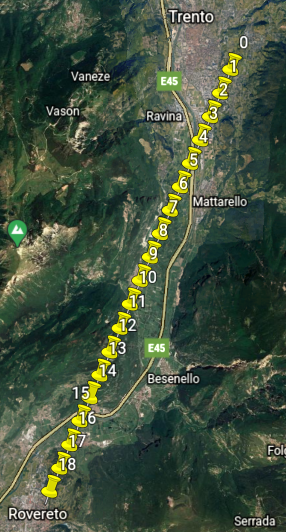

# Realizing an IoT scenario #

## Short Introduction ##
During a drone survey  factors as the wind speed or the air temperature are impacting the final result.
These factors can be detected and monitored continuously by using specific sensors.
The goal of this project is to simulate a real time data transfer system able to read and visualize the data from three sensors: GPS position, to track the position of the drone, the wind speed to have a real time overview about the flight conditions and the temperature to monitor the operating temperature range.

The **components** of the system are
```text
h1: MQTT broker (Eclipse Mosquitto)                     10.0.0.1:1883        
    - Manages the communication between h2 and h3

h2: Webserver (Node.js)                                 10.0.0.2:3000        
    - Collects the drone position and weather information
    - Publishes them in a HTML page
    - Generates the .kml file of the trajectory

h3: Drone (Python3)                                     10.0.0.3
    - Simulates and publish the GPS trajectory
    - Simulates and publish weather data

h4: Client (Links/Wget)                                 10.0.0.4 
    - Visualises the output of the webserver (h2)     
    - Downloads the trajectory file (.kml)  
```

The network **topology** is
```text
h1  --10Mbps--  s1  --10Mbps--  s2  --10Mbps--  h2
                    --10Mbps--  s3  --10Mbps--  h3  
                    --10Mbps--  s4  --10Mbps--  h4
```

## How to run ##
1. Start mininet and docker containers:
    ```bash
    sudo python3 topology.py
    ```
2. From h4 (Xterm) use the links web browser to see the drone trajectory and the weather data in a HTML page: 
    ```bash
    links 10.0.0.2:3000/drone
    ```
    or download them in .kml format:
    ```bash
    wget -O trajectory.kml 10.0.0.2:3000/kml
    ```
3. If you downloaded the trajectory file and you want to visualise it in Google Earth, run this command (in the ComnetsEmu VM) to get it from the viewer container
    ```bash
    docker cp srv4:/root/trajectory.kml .
    ```
    Finally, you can move it to a folder shared between the ComnetsEmu VM and the host operating system. This allows you to visualise nicely the trajetory in the Google Earth application. 
    
    