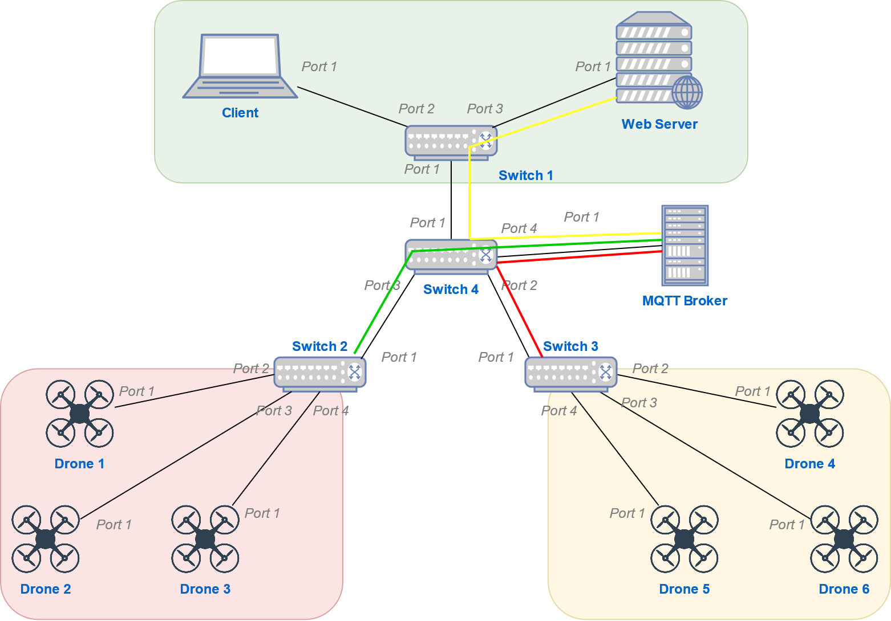
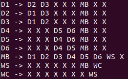
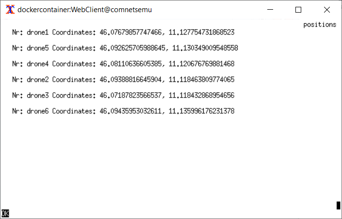
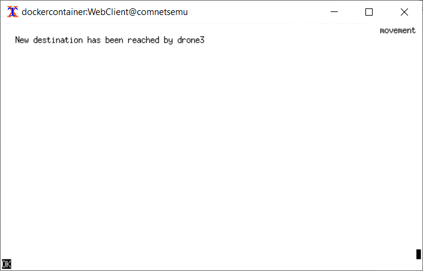
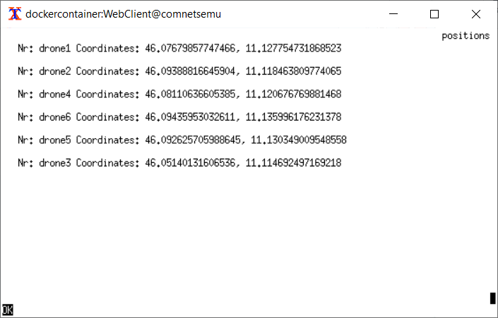
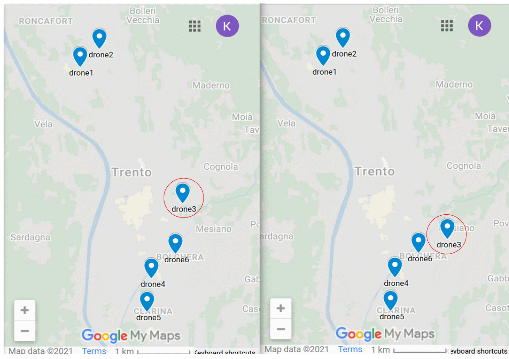

# Drones GPS tracker

## Project description

This project has been implemented by the following contributors as part of the PhD course [Computing in Communication Networks](https://ict.unitn.it/node/889):

* [Francesco Riz](https://webapps.unitn.it/du/it/Persona/PER0185299)
* [Stefano Berlato](https://www.dibris.unige.it/berlato-stefano)
* [Khakim Akhunov](https://webapps.unitn.it/du/en/Persona/PER0230856/Didattica)

### Requirements

* The [comnetsemu](https://git.comnets.net/public-repo/comnetsemu) virtual machine

### Functionality

The topology of the network is presented in the figure below. Given six drones flying over Trento, the aim of the system is to allow the user to move the drones by sending a command to the web server and to observe the drones' current position on a map in a web-browser. The functionality of the network's components are the following:

* Client 
  - sends the request to the web server containing the ID of a drone to move to a random position (longitude and latitude)
  - displays the drones' position in a terminal-based web-browser
  - sends the request to the web server to generate a .kml file suitable for displaying the drones' position in Google Maps
* Web server
  - responds to the Client, sending back an html web page or generating a .kml file with the drones' position
  - sends a request to the MQTT broker to subscribe to MQTT topics
  - publishes a MQTT message to order a drone to move to a given position
* MQTT broker
  - mediates MQTT subscribe/publish operations for the following topics:
    - "log": where each network component publishes logs for debug purposes
    - "positions": where drones publish updates on their position
    - "command_${ID}": where the web server sends commands to the drone with the specified ID to move to a given position
    - "current_position": where the web server sends commands to all drones to retrieve their current position
* Drone
  - moves to a new position
  - sends a request to the MQTT broker to subscribe to MQTT topics
  - publishes a MQTT message when the web server asks for the drone's position

### Topology

The network is sliced into three parts delineated by different colors in the figure. Devices belonging to different subnets are not able to communicate to each other. 



Thus, the following command in the mininet console
```bash
  > pingall
```
will output the following result:



where, D(id) - drone, MB - mqtt broker, WS - web server, WC - web client. 

## Content of the project

```
.
├── README.md                   : This file
├── pingall.png                 : pingall image in this description
├── topology.png                : topology image in this description
├── positionsBefore.png         : Initial drones positions in the example in this description
├── positionsAfter.png          : Final drones positions in the example in this description
├── moved.png                   : Command to move drones in the example in this description
├── maps-compare.gif            : maps comparison image in this description
└── webserver_mqtt_drones       : Working directory
    ├── build_docker_images.sh  : Bash script for building all needed docker images
    ├── connect_nodes.sh        : Bash script for network traffic management
    ├── Dockerfile.client       : Web client's docker image
    ├── Dockerfile.drone        : Drone's docker image
    ├── Dockerfile.mqtt         : MQTT broker's docker image
    ├── Dockerfile.webserver    : Web servers's docker image
    ├── drone_client_mqtt.py    : Drone's behavior and MQTT connection descriptions 
    ├── mosquitto.conf          : MQTT broker's configuration file
    ├── topology.py             : The main network topology
    └── webserver               : Web server node.js applications
        ├── app.js              : Web server's behavior description
        ├── bin
        │   └── www             : Web application's binary file
        ├── package.json        : Web application's node.js dependencies
        ├── public
        │   ├── javascripts
        │   │   └── mqtt.js     : Web server's MQTT connection description
        │   └── stylesheets
        │       └── style.css   : Cascading Style Sheets file for the web application
        ├── routes
        │   └── index.js        : Standard node.js index page routing 
        └── views
            ├── drone.pug       : HTML page template for drone positions (/positions)
            ├── index.pug       : HTML page template for index page (/)
            └── move.pug        : HTML page template for moving a drone (/move)
```

## How to Run
Go to working directory webserver_mqtt_drones

1. Build the images:
    ```bash
      $ sudo ./build_docker_images.sh
    ```
    or
    ```bash
      $ sudo bash build_docker_images.sh
    ```
    
2. Start mininet and docker containers:
    ```bash
      $ sudo python3 topology.py
    ```  
    
3. From WebClient (Xterm), start links web browser to observe the initial drones' positions over Trento:
    ```bash
      links 10.0.0.8:3000/positions
    ```
    
  
4. To generate the map file (.kml) suitable for Google Maps app, send the following request to the WebServer:
    ```bash
      links 10.0.0.8:3000/genmap
    ```

5. On your host machine, run the following command to copy the file from the WebClient host:
    ```bash
      $ sudo docker cp WebClient:/root/positions.kml .
    ```

6. To move any drone to a new random position, send the request (move?id=drone_id) to the WebServer:
    ```bash
      links 10.0.0.8:3000/move?id=drone3
    ```
    

7. From WebClient (Xterm), observe the new position of drone 3 over Trento:
    ```bash
      links 10.0.0.8:3000/positions
    ```
    
  
8. Repeat steps 4 and 5 to obtain a new map file (.kml)
  
9. You now have two different positioning files that can be compared on Google Maps showing that drone 3 actually moved.

    
