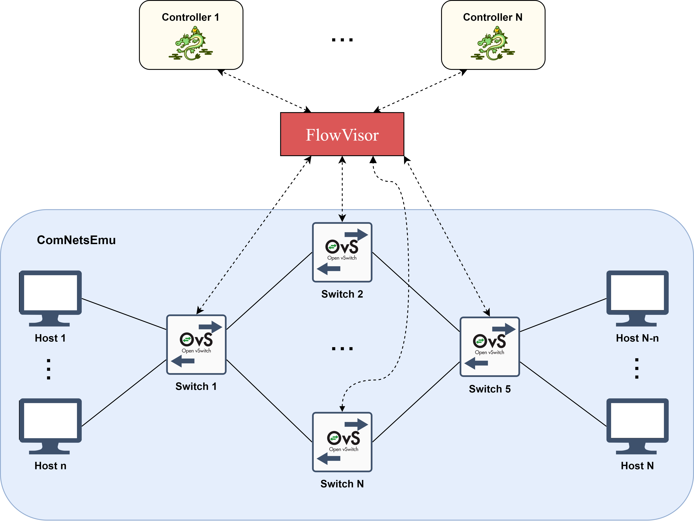
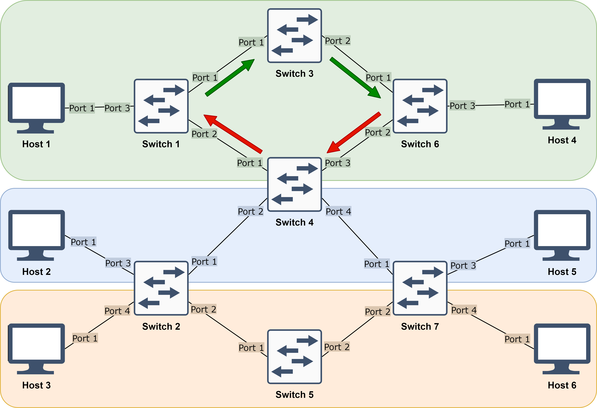
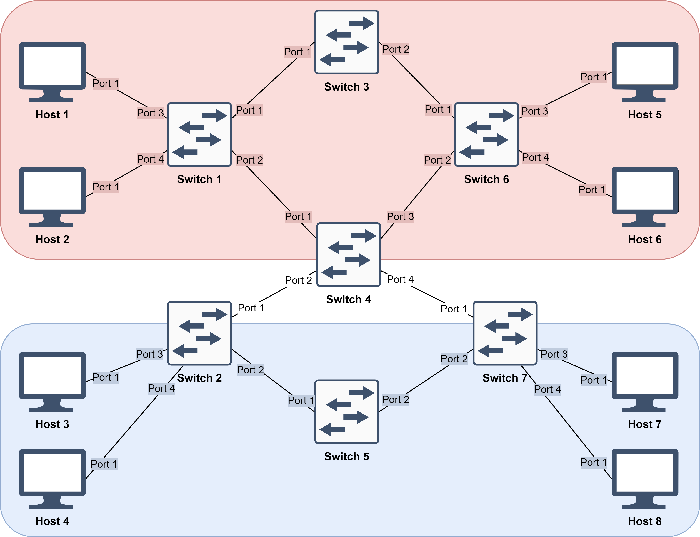
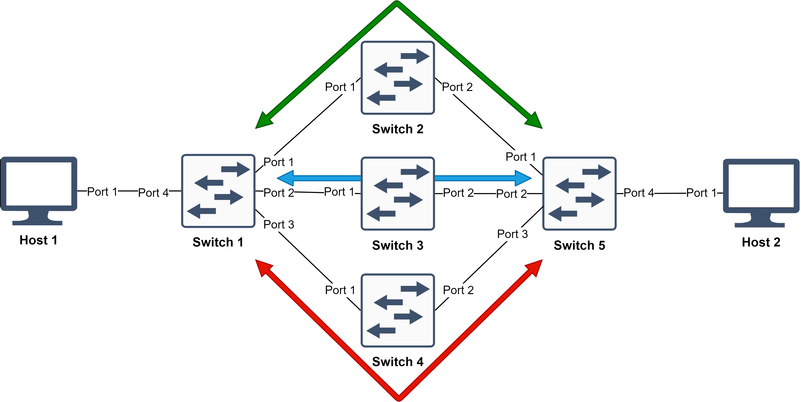
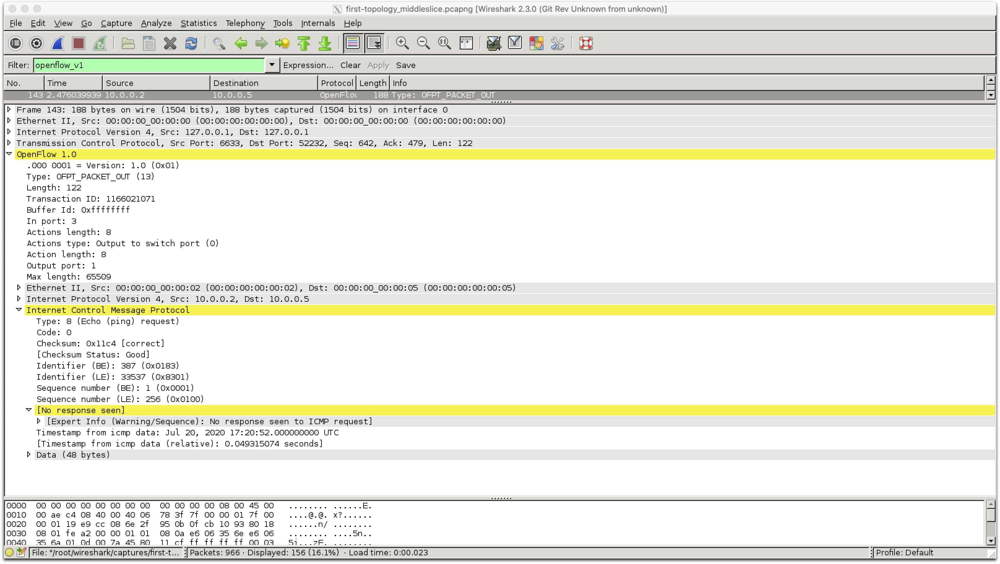

# Multi-tenant SDN Slicing in ComNetsEmu
Software developed as part of the exam:
*Softwarized and Virtualized Mobile Networks A.Y. 2019/2020 - UniTN*

**Andrea Abriani** - _Mat. 214978_  
**Fabio Della Giustina** - _Mat. 214979_  
**Davide Gagliardi** - _Mat. 214958_


## Table of Contents
- [Building Blocks](#building-blocks)
- [Implementation](#implementation)
  * [Integrating FlowVisor in ComNetsEmu](#integrating-flowvisor-in-comnetsemu)
- [Topologies](#topologies)
  * [First Topology](#first-topology)
    + [Demo](#demo)
      - [Setting up the topology (Mininet)](#setting-up-the-topology--mininet-)
      - [Setting up the core controller (FlowVisor)](#setting-up-the-core-controller--flowvisor-)
      - [Setting up the tenant controllers (RYU)](#setting-up-the-tenant-controllers--ryu-)
      - [Testing reachability](#testing-reachability)
  * [Second Topology](#second-topology)
    + [Demo](#demo-1)
      - [Setting up the topology (Mininet)](#setting-up-the-topology--mininet--1)
      - [Setting up the core controller (FlowVisor)](#setting-up-the-core-controller--flowvisor--1)
      - [Setting up the tenant controllers (RYU)](#setting-up-the-tenant-controllers--ryu--1)
      - [Upper slice demonstration](#upper-slice-demonstration)
      - [Lower slice demonstration](#lower-slice-demonstration)
  * [Third Topology](#third-topology)
    + [Demo](#demo-2)
      - [Setting up the topology (Mininet)](#setting-up-the-topology--mininet--2)
      - [Setting up the core controller (FlowVisor)](#setting-up-the-core-controller--flowvisor--2)
      - [Setting up the tenant controllers (RYU)](#setting-up-the-tenant-controllers--ryu--2)
      - [Upper slice demonstration](#upper-slice-demonstration-1)
      - [Middle slice demonstration](#middle-slice-demonstration)
      - [Lower slice demonstration](#lower-slice-demonstration-1)
- [Known Issue](#known-issue)


## Building Blocks

- **Open vSwitch (v2.7)**: open-source multi-layer virtual switch manager that allows the communication between "dumb switches" and controllers.
- **RYU (v4.34)**: component-based Software Defined Networking framework implemented in Python that provides a simple way to define control functionalities for an OpenFlow controller.
- **FlowVisor (v1.4)**: special purpose OpenFlow controller that acts as a transparent proxy between OpenFlow switches and multiple OpenFlow controllers.


## Implementation



- **Topology** (hosts and switches): defined in ComNetsEmu.
- **FlowVisor** (core controller): stands in between the switches and the tenant controllers; defines the slices to which one RYU controller is assigned each (enabling multi-tenancy); policy checks each OpenFlow message that goes through it, checking permissions related to the policies defined.
- **RYU controllers** (tenant controllers): defined in ComNetsEmu.

*Note*: FlowVisor v1.4 (last open-source version available) is based on OpenFlow 1.0, thus both the Open vSwitch switches and the RYU controllers need to be set up working with OpenFlow 1.0.

### Integrating FlowVisor in ComNetsEmu

Since FlowVisor is quite old and outdated, it needs to be implemented in a Docker container running an old CentOS image with an old version of Java (required by FlowVisor).


## Topologies

### First Topology



First topology presents 3 slices (topology slicing):
- **Upper**: tenant controller forwards traffic based on direction (left-to-right and right-to-left, via Switch 3 and Switch 4 respectively).
- **Middle**: tenant controller implements simple forwarding, flows are set up during configuration phase.
- **Lower**: tenant controller implements simple forwarding, flows are set up during operational phase.

#### Demo
Start up ComNetsEmu VM `vagrant up comnetsemu` and log into it `vagrant ssh comnetsemu`.

##### Setting up the topology (Mininet)
Set up the topology with Mininet:
```bash
vagrant@comnetsemu:~/comnetsemu/SVMN_project/1st_scenario $ sudo mn -c  # To flush any previous configurations
vagrant@comnetsemu:~/comnetsemu/SVMN_project/1st_scenario $ sudo python3 first-topology.py
```

##### Setting up the core controller (FlowVisor)
In a new terminal.

The first time, build the FlowVisor image:
```bash
vagrant@comnetsemu:~/comnetsemu/SVMN_project/flowvisor $ ./build_flowvisor_image.sh
```

Run the Flowvisor container:
```bash
vagrant@comnetsemu:~/comnetsemu/SVMN_project/flowvisor $ ./run_flowvisor_container.sh

*Note*: Please verify that the directory in the file above points to the correct folder using the absolute path. Otherwise, the folder below will be empty.

[root@comnetsemu ~] cd slicing_scripts
[root@comnetsemu slicing_scripts] ./1st-flowvisor_slicing.sh  # Press ENTER when a slice password is required (empty password)
```

##### Setting up the tenant controllers (RYU)
Open a new terminal for each controller.

Upper slice controller:
```bash
vagrant@comnetsemu:~/comnetsemu/SVMN_project/1st_scenario $ ryu run --observe-links --ofp-tcp-listen-port 10001 --wsapi-port 8082 /usr/local/lib/python3.6/dist-packages/ryu/app/gui_topology/gui_topology.py ryu-upperslice.py
```

Middle slice controller:
```bash
vagrant@comnetsemu:~/comnetsemu/SVMN_project/1st_scenario $ ryu run --observe-links --ofp-tcp-listen-port 10002 --wsapi-port 8083 /usr/local/lib/python3.6/dist-packages/ryu/app/gui_topology/gui_topology.py ryu-middleslice.py
```

Lower slice controller:
```bash
vagrant@comnetsemu:~/comnetsemu/SVMN_project/1st_scenario $ ryu run --observe-links --ofp-tcp-listen-port 10003 --wsapi-port 8084 /usr/local/lib/python3.6/dist-packages/ryu/app/gui_topology/gui_topology.py ryu-lowerslice.py
```

Check the status of each slice infrastructure (as seen by each tenant controller) on your browser:
- Upper slice: [0.0.0.0:8082](http://0.0.0.0:8082)
- Middle slice: [0.0.0.0:8083](http://0.0.0.0:8083)
- Lower slice: [0.0.0.0:8084](http://0.0.0.0:8084)

##### Testing reachability

Perfom a ping from Host 1 to Host 4:
```bash
mininet> h1 ping h4
```

Check flows inserted in Switch 3 and Switch 4:
```bash
sudo ovs-ofctl dump-flows s3
sudo ovs-ofctl dump-flows s4
```

Perform a ping from Host 2 to Host 5:
```bash
mininet> h2 ping h5
```

Perform a ping from Host 3 to Host 6:
```bash
mininet> h3 ping h6
```

**IMPORTANT**: Before moving to another scenario it is strongly recommended to flush everything with `sudo mn -c` and stop the VM with `vagrant halt comnetsemu`.


### Second Topology



Second topology presents 2 slices (topology slicing):
- **Upper**: tenant controller discriminates traffic based on transport layer protocol and port (UDP traffic on port 9999 via Switch 3 and all the other traffic via Switch 4).
- **Lower**: tenant controller applies packet flooding.

#### Demo

Start up ComNetsEmu VM `vagrant up comnetsemu` and log into it `vagrant ssh comnetsemu`.

##### Setting up the topology (Mininet)
Set up the topology with Mininet:
```bash
vagrant@comnetsemu:~/comnetsemu/SVMN_project/2nd_scenario $ sudo mn -c  # To flush any previous configurations
vagrant@comnetsemu:~/comnetsemu/SVMN_project/2nd_scenario $ sudo python3 second-topology.py
```

##### Setting up the core controller (FlowVisor)
In a new terminal, run the Flowvisor container:
```bash
vagrant@comnetsemu:~/comnetsemu/SVMN_project/flowvisor $ ./run_flowvisor_container.sh

[root@comnetsemu ~] cd slicing_scripts
[root@comnetsemu slicing_scripts] ./2nd-flowvisor_slicing.sh  # Press ENTER when a slice password is required (empty password)
```

##### Setting up the tenant controllers (RYU)
Open a new terminal for each controller.

Upper slice controller:
```bash
vagrant@comnetsemu:~/comnetsemu/SVMN_project/2nd_scenario $ ryu run --observe-links --ofp-tcp-listen-port 10001 --wsapi-port 8082 /usr/local/lib/python3.6/dist-packages/ryu/app/gui_topology/gui_topology.py ryu-upperslice.py
```

Lower slice controller:
```bash
vagrant@comnetsemu:~/comnetsemu/SVMN_project/2nd_scenario $ ryu run --observe-links --ofp-tcp-listen-port 10002 --wsapi-port 8083 /usr/local/lib/python3.6/dist-packages/ryu/app/gui_topology/gui_topology.py ryu-lowerslice.py
```

Check the status of each slice infrastructure (as seen by each tenant controller) on your browser:
- Upper slice: [0.0.0.0:8082](http://0.0.0.0:8082)
- Lower slice: [0.0.0.0:8083](http://0.0.0.0:8083)

##### Upper slice demonstration

Verify UDP traffic on port 9999 via Switch 3 and other traffic via Switch 4 instead.

Open an X terminal for Host 1 and Host 5:
```bash
mininet> xterm h1
mininet> xterm h5
```

Run an iPerf server and client connection, on Host 5 and Host 1 respectively:
```bash
xterm-h5> iperf -s -u -p 9999  # UDP iPerf server on port 9999
xterm-h1> iperf -c 10.0.0.5 -u -p 9999 -t 10 -i 1  # UDP iPerf client on port 9999
```

Check flows inserted in Switch 3 and Switch 4:
```bash
sudo ovs-ofctl dump-flows s3
sudo ovs-ofctl dump-flows s4
```

Run an iPerf server and client connection, on Host 5 and Host 1 respectively:
```bash
xterm-h5> iperf -s -p 9999  # TCP iPerf server on port 9999
xterm-h1> iperf -c 10.0.0.5 -p 9999 -t 10 -i 1  # TCP iPerf client on port 9999
```

Check flows inserted in Switch 3 and Switch 4:
```bash
sudo ovs-ofctl dump-flows s3
sudo ovs-ofctl dump-flows s4
```

##### Lower slice demonstration

Verify that the slice is operational while switches are set up to flood every packet received. Exploit also the `echo_server` Docker container set up on Host 4, Host 7 and Host 8.

Use the X terminal automatically spawned when run the topology. If not open, do it manually:
```bash
mininet> xterm h3
```

Try to connect to `echo_server` machines. When connection is established, for each message sent an exact copy is returned:  
```bash
xterm-h3> telnet 10.0.0.7 65000
xterm-h3> telnet 10.0.0.4 65000
xterm-h3> telnet 10.0.0.8 65000
```

**IMPORTANT**: Before moving to another scenario it is strongly recommended to flush everything with `sudo mn -c` and stop the VM with `vagrant halt comnetsemu`.


### Third Topology



Third topology presents 3 slices (service slicing implemented in FlowVisor):
- Upper: TCP traffic on port 9999 via Switch 2.
- Middle: UDP traffic on port 9998 via Switch 3.
- Lower: other traffic via Switch 4.

FlowVisor assigns different traffic to different slices based on transport layer protocol and port, even through the same physical port.

For each slice a different tenant controller is assigned with the same forwarding technique.

#### Demo
Start up ComNetsEmu VM `vagrant up comnetsemu` and log into it `vagrant ssh comnetsemu`.

##### Setting up the topology (Mininet)
Set up the topology with Mininet:
```bash
vagrant@comnetsemu:~/comnetsemu/SVMN_project/3rd_scenario $ sudo mn -c  # To flush any previous configurations
vagrant@comnetsemu:~/comnetsemu/SVMN_project/3rd_scenario $ sudo python3 third-topology.py
```

##### Setting up the core controller (FlowVisor)
In a new terminal, run the Flowvisor container:
```bash
vagrant@comnetsemu:~/comnetsemu/SVMN_project/flowvisor $ ./run_flowvisor_container.sh

[root@comnetsemu ~] cd slicing_scripts
[root@comnetsemu slicing_scripts] ./3rd-flowvisor_slicing.sh  # Press ENTER when a slice password is required (empty password)
```

##### Setting up the tenant controllers (RYU)
Open a new terminal for each controller.

Upper slice controller:
```bash
vagrant@comnetsemu:~/comnetsemu/SVMN_project/3rd_scenario $ ryu run --observe-links --ofp-tcp-listen-port 10001 --wsapi-port 8082 /usr/local/lib/python3.6/dist-packages/ryu/app/gui_topology/gui_topology.py ryu-upperslice.py
```

Middle slice controller:
```bash
vagrant@comnetsemu:~/comnetsemu/SVMN_project/3rd_scenario $ ryu run --observe-links --ofp-tcp-listen-port 10002 --wsapi-port 8083 /usr/local/lib/python3.6/dist-packages/ryu/app/gui_topology/gui_topology.py ryu-middleslice.py
```

Lower slice controller:
```bash
vagrant@comnetsemu:~/comnetsemu/SVMN_project/3rd_scenario $ ryu run --observe-links --ofp-tcp-listen-port 10003 --wsapi-port 8084 /usr/local/lib/python3.6/dist-packages/ryu/app/gui_topology/gui_topology.py ryu-lowerslice.py
```

Check the status of each slice infrastructure (as seen by each tenant controller) on your browser:
- Upper slice: [0.0.0.0:8082](http://0.0.0.0:8082)
- Middle slice: [0.0.0.0:8083](http://0.0.0.0:8083)
- Lower slice: [0.0.0.0:8084](http://0.0.0.0:8084)

##### Upper slice demonstration

Verify that TCP traffic on port 9999 is handled by upper tenant controller via Switch 2.

Open an X terminal for Host 1 and Host 2:
```bash
mininet> xterm h1
mininet> xterm h2
```

Run an iPerf server and client connection, on Host 2 and Host 1 respectively:
```bash
xterm-h2> iperf -s -p 9999  # TCP iPerf server on port 9999
xterm-h1> iperf -c 10.0.0.2 -p 9999 -t 10 -i 1  # TCP iPerf client on port 9999
```

Check flows inserted in Switch 2, Switch 3 and Switch 4:
```bash
sudo ovs-ofctl dump-flows s2
sudo ovs-ofctl dump-flows s3
sudo ovs-ofctl dump-flows s4
```

##### Middle slice demonstration

Verify that UDP traffic on port 9998 is handled by middle tenant controller via Switch 3.

Use the X terminal for Host 1 and Host 2 previously spawned. In case they have been exited, respawn them:
```bash
mininet> xterm h1
mininet> xterm h2
```

Run an iPerf server and client connection, on Host 2 and Host 1 respectively:
```bash
xterm-h2> iperf -s -u -p 9998  # UDP iPerf server on port 9998
xterm-h1> iperf -c 10.0.0.2 -u -p 9998 -t 10 -i 1  # UDP iPerf client on port 9998
```

Check flows inserted in Switch 2, Switch 3 and Switch 4:
```bash
sudo ovs-ofctl dump-flows s2
sudo ovs-ofctl dump-flows s3
sudo ovs-ofctl dump-flows s4
```

##### Lower slice demonstration
Verify that other traffic is handled by lower tenant controller via Switch 4.

Use the X terminal for Host 1 and Host 2 previously spawned. In case they have been exited, respawn them:
```bash
mininet> xterm h1
mininet> xterm h2
```

Run an iPerf server and client connection, on Host 2 and Host 1 respectively:
```bash
xterm-h2> iperf -s -u -p 9990  # UDP iPerf server on port 9990
xterm-h1> iperf -c 10.0.0.2 -u -p 9990 -t 10 -i 1  # UDP iPerf client on port 9990
```

Check flows inserted in Switch 2, Switch 3 and Switch 4:
```bash
sudo ovs-ofctl dump-flows s2
sudo ovs-ofctl dump-flows s3
sudo ovs-ofctl dump-flows s4
```

**IMPORTANT**: When exiting the scenario it is strongly recommended to flush everything with the command `sudo mn -c`.


## Known Issue

An issue was found during the project. It is related to the forwarding OpenFlow packet_out messages when commanded by the OpenFlow tenant controller to the switches. This kind of error takes place only in switches that are shared among two or more slices in the FlowVisor definition. More specifically, the pattern we found shows no issues on the first controller assigned to the shared switch, instead manifesting itself for all subsequent controllers assigned to it within FlowVisor.

As an example, this issue may arise in the first topology exposed, from the handling by the middle slice tenant controller to command a packet_out message to Switch 4 (which is shared with the upper slice). That would generate an error, illustrated below, of type "bad permissions" on the switch.

```bash
EVENT ofp_event->NoFlowEntry EventOFPPacketIn
INFO packet arrived in s4 (in_port=2)
INFO sending packet from s4 (out_port=4)
EventOFPErrorMsg received.
version=0x1, msg_type=0x1, msg_len=0x6a, xid=0x0
 `-- msg_type: OFPT_ERROR(1)
OFPErrorMsg(type=0x2, code=0x6, data=b'\x01\x0d\x00\x5e\xa8\x8c\x25\x6d\xff\xff\xff\xff\x00\x02\x00\x08\x00\x00\x00\x08\x00\x04\xff\xe5\x33\x33\x00\x00\x00\x02\x8a\x52\x84\x58\x39\x17\x86\xdd\x60\x00\x00\x00\x00\x10\x3a\xff\xfe\x80\x00\x00\x00\x00\x00\x00\x88\x52\x84\xff\xfe\x58\x39\x17\xff\x02\x00\x00\x00\x00\x00\x00\x00\x00\x00\x00\x00\x00\x00\x02\x85\x00\xef\xa9\x00\x00\x00\x00\x01\x01\x8a\x52\x84\x58\x39\x17')
 |-- type: OFPET_BAD_ACTION(2)
 |-- code: OFPBAC_EPERM(6)
 `-- data: version=0x1, msg_type=0xd, msg_len=0x5e, xid=0xa88c256d
     `-- msg_type: OFPT_PACKET_OUT(13)
```

Even analyzing the behaviour thanks to Wireshark we integrated into the VM, we have not been able to tackle further this issue. On Wireshark a missing ICMP response highlights when dissecting the packet_out message information, but still the same situation happens also on the upper slice, which instead runs unaffected.



It is worth noting that the whole project was developed on a L2 level, ignoring the packet loss checking that is usually performed by applications on the application level.
Without considering that, as an escamotage, on the problematic slices the forwarding rules are assigned on the configuration phase between tenant controller and switch, in order to avoid the loss of the first packets that would otherwise not be sent back from the switch because of the issue (as implemented for the middle controller of the first topology).
As another solution, it may have been interesting to evaluate the outcome when adopting the packet buffering on the switch, thus avoiding the sending of packet data back and forth between the controller and switch. However, this was not possible because the Open vSwitch version used in the switches (Open vSwitch v2.7), is lacking the buffering feature (removed from Open vSwitch v2.5). On the other hand, we did not proceed to downgrade Open vSwitch in order to avoid further problematics that may arise from it.
